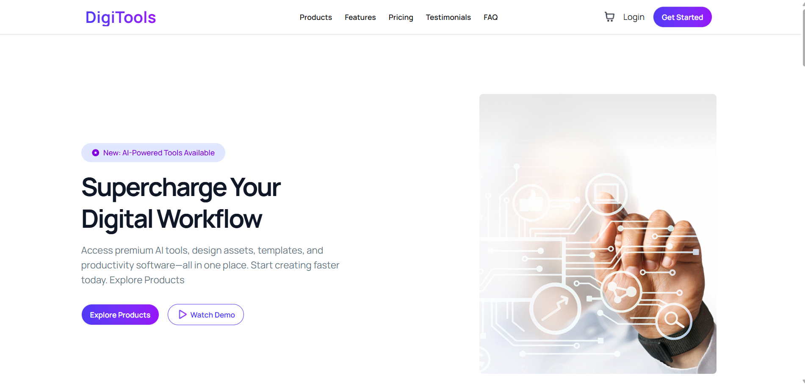
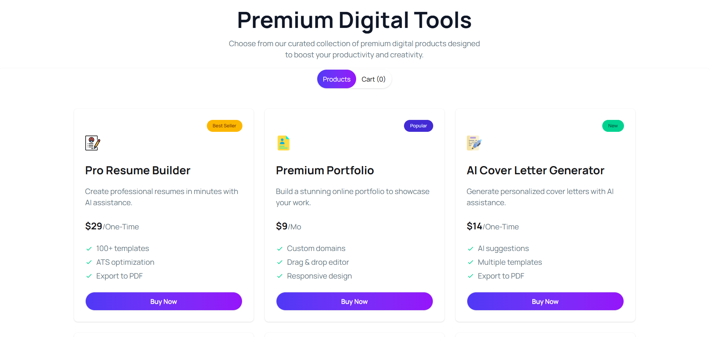
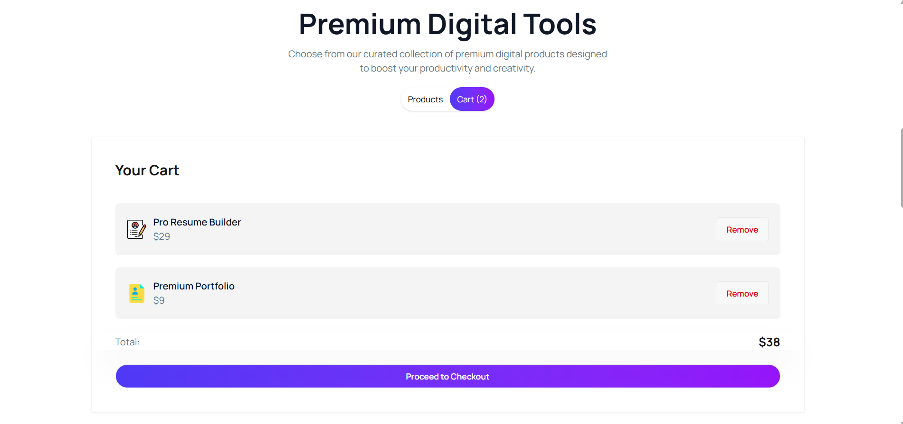

# DigiTools – Digital Tools Buying Website

**DigiTools** is a modern digital tools marketplace where users can browse premium digital products and add them to a cart. Users can explore tools, view product features, and simulate a simple checkout experience.

The website is designed based on **Figma** and built using **React** with a clean, responsive, and user-friendly interface.

---

## 📌 Project Overview

DigiTools allows users to explore digital tools and simulate a simple online shopping experience.  
Users can browse products, view detailed information, add items to the cart, remove items, and proceed to checkout.

The project focuses on **dynamic UI interaction, cart management, and responsive design**.

---

## 🔗 Live Project

- Live Site: https://digital-tools-buying-web-assignment-6.netlify.app/
- Repository: https://github.com/nahidforever/B13-Assignment-06.git

---

## 📸 Project Demo

<p align="center">
<b>Home Page</b><br>

</p>

<p align="center">
<b>All Product Cards</b><br>

</p>

<p align="center">
<b>Selected Product</b><br>

</p>

---

## 🚀 Technologies Used

- ⚛️ React.js  
- 🎨 Tailwind CSS  
- 🌼 DaisyUI  
- 🧠 JavaScript (ES6+)  
- 🔔 React-Toastify  
- 📦 JSON (for product data)

---

## ✨ Key Features

### 🛒 1. Dynamic Cart System
- Add products to cart instantly
- Remove individual products from the cart
- Proceed to checkout clears the cart
- Real-time cart count update in the Navbar

### 🔄 2. Product & Cart Toggle System
- Toggle between **Products view** and **Cart view**
- Default view displays the product list
- Displays an **empty cart message** when no products are added

### 📦 3. Product Display with Rich UI
Responsive **3-column product layout**.  
Each product card includes:
- Product Name
- Price
- Description
- Features list
- Product Tag (Popular / New / Best Seller)
- Icon
- Buy Now button  
Clean UI with icons, cards, and gradient design.

### 🎨 Additional Features
- 🔔 Toast notifications for **Add to Cart** and **Checkout**
- 📱 Fully responsive design
- 🪜 Steps section explaining how the platform works
- 💰 Pricing section with modern UI
- 🦶 Footer and Navbar designed based on Figma layout

---

## 🧩 Sections Included

- Navbar
- Banner
- Stats Section
- Product & Cart Toggle Section
- Steps Section
- Pricing Section
- Footer

---

## 📦 Dependencies

The project uses the following libraries and packages:

- React
- Tailwind CSS
- DaisyUI
- React Toastify
- React Icons

---

## 💻 Run the Project Locally

Follow these steps to run the project on your local machine:

1️⃣ **Clone the Repository**
```bash
https://github.com/nahidforever/B13-Assignment-06.git
```

2️⃣ **Navigate to Project Folder**
```bash
cd digitools
```

3️⃣ **Install Dependencies**
```bash
npm install
```

4️⃣ **Run the Development Server**
```bash
npm run dev
```

5️⃣ **Open in Browser**
Go to: [http://localhost:5173](http://localhost:5173)

